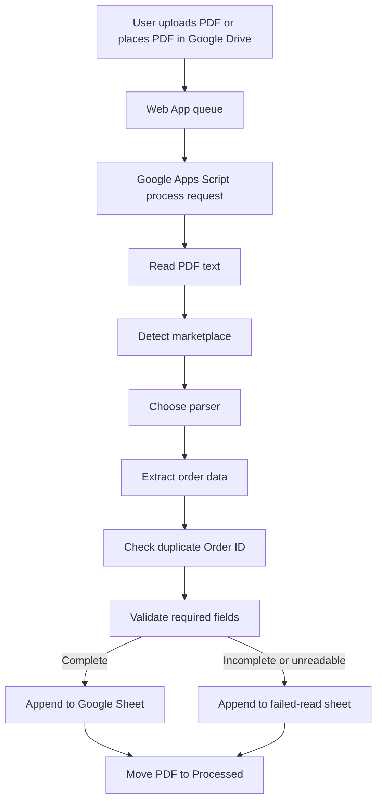

# PDF Order Intake Web App Design

Date: 2026-07-28
Workspace: Sheet Lable online

## Goal

Build an easy-to-use web app prototype for processing marketplace order PDFs. The first version should let users upload PDFs, watch the processing workflow, review extracted orders, and understand which records are ready for Google Sheets or need correction.

The prototype will also include a clear integration path for Google Apps Script so it can later connect to Google Drive folders, Google Sheets, and a Processed folder.

## Primary Users

- Operations users who receive marketplace order PDFs and need labels or sheet rows quickly.
- Non-technical users who should not need to understand parsing details.

## Usability Principles

- Use one main screen for upload, queue, processing status, and results.
- Show plain Thai status labels such as "ข้อมูลครบ", "ข้อมูลไม่ครบ", "Order ID ซ้ำ", and "อ่าน PDF ไม่สำเร็จ".
- Make the main action obvious: upload PDF, process, review, export/save.
- Avoid technical setup fields on the first screen. Integration settings can live in a separate configuration area or code constants.
- Make incomplete data easy to spot by highlighting missing fields.

## First Version Scope

### Web App Prototype

- Local PDF upload control with drag-and-drop and file picker.
- Google Drive queue panel with sample Drive files.
- Processing timeline based on the workflow:
  1. Read PDF text
  2. Detect marketplace
  3. Select parser
  4. Extract order items
  5. Check duplicate Order ID
  6. Validate required data
- Marketplace parser simulation for:
  - Shopee
  - Lazada
  - TikTok Shop
  - Unknown marketplace
- Results table showing:
  - File name
  - Marketplace
  - Order ID
  - Customer
  - Items
  - Total
  - Status
  - Missing fields or duplicate reason
- Summary cards for processed files, ready rows, duplicate orders, and failed reads.
- Simple review drawer or detail panel for selected rows.

### Apps Script Integration Skeleton

Include a draft Apps Script implementation with:

- `doPost(e)` endpoint for web app uploads or process requests.
- Drive folder constants for input and processed folders.
- Sheet constants for success and failed-read sheets.
- PDF text extraction placeholder.
- Marketplace detection.
- Parser dispatch by marketplace.
- Duplicate Order ID check against Google Sheets.
- Required field validation.
- Append to success sheet when complete.
- Append to failed-read sheet when incomplete or unreadable.
- Move processed PDFs to the Processed folder after handling.

## Data Flow

## Required Fields

The first version should treat these as required:

- Order ID
- Marketplace
- Customer name
- At least one item
- Quantity
- Delivery or address summary

## Non-Goals for First Version

- Real OCR accuracy guarantees.
- Google OAuth setup inside the web app.
- Production authentication and role permissions.
- Full marketplace parser coverage.
- Automatic correction of malformed PDF data.

## Implementation Preference

Use a modern frontend app with a polished but practical dashboard layout. Because the workspace is empty, use a standard lightweight React/Vite-style site unless a hosting scaffold requires a different structure.

The UI should be operational, not a marketing landing page. It should feel like a tool people can open every morning and process files quickly.

## Acceptance Criteria

- User can add a PDF in the UI and run a simulated processing workflow.
- UI clearly shows each processing step and final branch.
- Result rows clearly distinguish complete, incomplete, duplicate, and failed-read outcomes.
- Apps Script skeleton maps directly to the provided workflow.
- Project can be started locally with a documented command.
- Build or equivalent verification passes.
